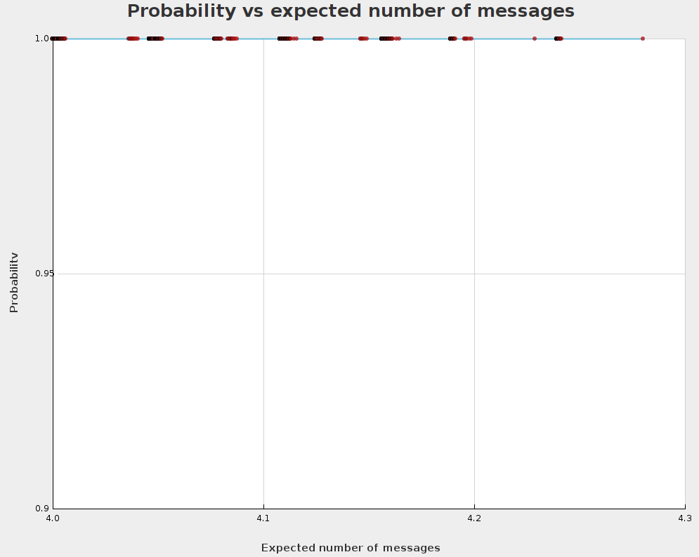

### 1
> [yaml-файл спецификации](./consensus-analyzer/hw/resources/cnf_hw.yaml)

### 3

Дисперсия распределения вероятностей около 0, а сама вероятность - около 1 при 4+ сообщениях (вероятность консенсуса = 1)

### 4

> [Файл логов планировщика](./consensus-scheduler/target/test-classes/runTest.log)
